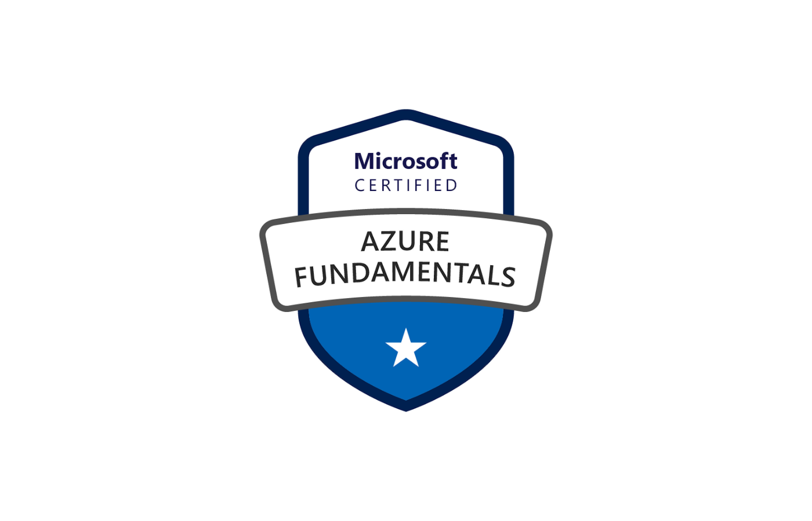

# Servicios core en la nube (AZ-900) – Resumen de los puntos principales

## 1. Objetivos del módulo
- Describir los **servicios principales de Azure**, sus componentes de arquitectura y los recursos disponibles.

---

## 2. Jerarquía de administración y gobierno
| Nivel | Propósito |
|-------|-----------|
| **Recurso** | Instancia individual (VM, cuenta de almacenamiento, base de datos, etc.). |
| **Grupo de recursos** | Contenedor lógico para implementar y gestionar recursos relacionados. |
| **Suscripción** | Límite de facturación y control de acceso; agrupa cuentas de usuario y recursos. |
| **Grupo de administración** | Aplica políticas y RBAC a varias suscripciones de forma jerárquica. |

> **Azure Resource Manager (ARM)** agrega capa de gestión: plantillas declarativas, control de acceso (RBAC), etiquetas, dependencias y facturación por etiquetas.  

---

## 3. Infraestructura global de Azure
- **Regiones**: áreas geográficas con ≥ 1 centro de datos de baja latencia.  
- **Regiones especiales**: US Gov, China, etc., con requisitos de soberanía.  
- **Zonas de disponibilidad**: centros de datos aislados dentro de una región para resiliencia.  
- **Pares de regiones**: actualización escalonada y replicación dentro de la misma geografía.  

---

## 4. Servicios de cómputo
| Servicio | Uso principal |
|----------|---------------|
| **Máquinas Virtuales & VM Scale Sets** | IaaS flexible; escalado manual o automático. |
| **Azure Container Instances (ACI)** | Contenedores sin infraestructura para cargas breves. |
| **Azure Kubernetes Service (AKS)** | Orquestador gestionado para microservicios. |
| **App Service (PaaS)** | Hospedaje de Web Apps, APIs, back-ends móviles. |
| **Azure Functions (Serverless)** | Ejecución basada en eventos, micro-facturación por milisegundo. |
| **Azure Virtual Desktop** | Escritorios y apps Windows desde cualquier dispositivo. |

---

## 5. Red (Azure Virtual Network)
- Proporciona **aislamiento**, **segmentación**, acceso a Internet, comunicación entre recursos y on-premises (VPN P2S / S2S, ExpressRoute).  
- **Seguridad y control**: NSG, UDR, emparejamiento de VNets, tablas de rutas y BGP.  
- **Azure VPN Gateway**: conectividad S2S, P2S y VNet-to-VNet, con opciones Activo/Espera y Activo/Activo.  

---

## 6. Almacenamiento
| Tipo | Casos de uso |
|------|--------------|
| **Disk Storage (SSD/HDD, Ultra)** | Discos para VM; rendimiento escalable. |
| **Blob Storage** | Objetos no estructurados; tiers Hot, Cool, Archive. |
| **Azure Files** | SMB/NFS totalmente gestionado; lift-and-shift de shares locales. |

---

## 7. Bases de datos administradas
- **Azure Cosmos DB**: multimodelo, baja latencia global, SLAs de rendimiento y consistencia.  
- **Azure SQL Database**: SQL Server as-a-service, 99,99 % de disponibilidad.  
- **SQL Managed Instance**: compatibilidad casi total con SQL Server, dentro de VNet.  
- **Azure Database for MySQL / PostgreSQL**: motores open-source gestionados, alta disponibilidad y escalado en segundos.  

---

## 8. Analítica y Big Data
- **Azure Synapse Analytics**: almacén de datos + análisis de big data con consultas provisionadas o serverless.  
- **Azure Data Factory**: orquestación e integración de datos ETL/ELT en la nube.  
- **Azure Databricks**: Apache Spark colaborativo para IA y data science.  
- **Azure Data Lake (Storage & Analytics)**: repositorio masivo + análisis on-demand con pago por uso.  

---

## 9. Ideas clave para el examen
1. Recordar la **jerarquía**: Management Group → Subscription → Resource Group → Resource.  
2. Elegir **regiones** y **zonas** adecuadas para latencia y resiliencia.  
3. Diferenciar **IaaS (VM)**, **PaaS (App Service, SQL DB)** y **Serverless (Functions)**.  
4. Emparejar VNets y usar NSG/UDR para un diseño de red seguro.  
5. Seleccionar la **tier de almacenamiento** correcta (Hot/Cool/Archive) para optimizar costes.  
6. Para bases de datos, escoger **Cosmos DB** si se requiere replicación global y milisegundos de latencia; **SQL DB/MySQL/PostgreSQL** para relacional gestionado.  
7. En analítica, **Synapse** integra SQL DW + Spark; **Databricks** se centra en notebooks y ML colaborativo.  

---

> **TIP**: Usa plantillas ARM/Bicep y etiquetas para despliegues consistentes y para segmentar la facturación.
