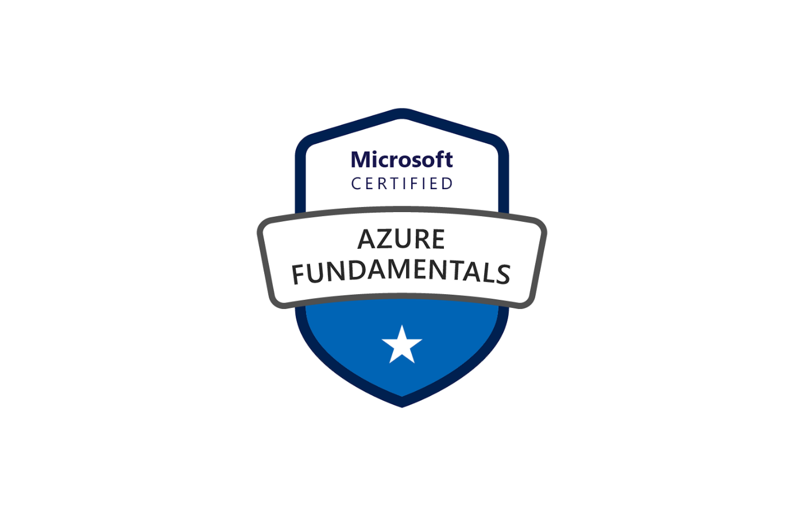

# Servicios de red y seguridad en Azure (AZ-900) – Resumen de puntos principales

## 1. Objetivos del módulo
- **Identificar** las soluciones principales de red y seguridad disponibles en Azure.  
- **Reconocer** las herramientas de administración y supervisión que las acompañan.

---

## 2. IoT en Azure
| Servicio | Propósito destacado |
|----------|--------------------|
| **Azure IoT Hub** | Mensajería bidireccional “dispositivo ⇆ nube”, telemetría, control remoto. |
| **Azure IoT Central** | SaaS con panel listo para conectar, monitorizar y administrar dispositivos mediante plantillas. |
| **Azure Sphere** | Solución end-to-end segura: MCU certificado, SO Linux personalizado y servicio AS3 para autenticación y actualizaciones OTA. |

---

## 3. Servicios de Inteligencia Artificial
| Servicio | ¿Para qué se usa? |
|----------|-------------------|
| **Azure Machine Learning** | Entrenar, probar y desplegar modelos predictivos como API en tiempo real. |
| **Azure Cognitive Services** | API pre-entrenadas para visión, voz, lenguaje y decisiones (recomendaciones, moderación, anomalías). |
| **Azure Bot Service** | Crear agentes virtuales que conversan por texto, tarjetas o voz, integrados con Bot Framework. |

---

## 4. DevOps y control de código
- **Azure DevOps Services**  
  - *Repos* (control de versiones), *Boards* (Kanban y seguimiento), *Pipelines* (CI/CD), *Artifacts*, *Test Plans*.  
- **GitHub + GitHub Actions**: repositorios abiertos o privados, gestión de issues, flujos CI/CD con Actions.  
- **Azure DevTest Labs**: aprovisiona, configura y desmonta entornos de prueba de forma automática para ahorrar costes.

---

## 5. Seguridad de datos y postura de seguridad
| Servicio | Función principal |
|----------|------------------|
| **Azure Key Vault** | Almacena secretos, claves y certificados con control de acceso y registro. |
| **Azure Security Center** | Supervisa la postura de seguridad, aplica configuraciones, recomienda mejoras y calcula el *Secure Score*. |
| **Azure Sentinel** | SIEM en la nube: recopila datos, detecta amenazas con IA, investiga y orquesta la respuesta. |

---

## 6. Herramientas de administración y automatización
- **Azure Portal**: IU web gráfica para crear y configurar casi cualquier recurso.  
- **App móvil de Azure**: supervisión y acciones básicas desde iOS/Android.  
- **Azure PowerShell** y **Azure CLI**: cmdlets o comandos Bash que llaman a la API REST; útiles para scripts repetibles.  
- **Plantillas ARM**: describe infra en JSON declarativo, valida dependencias y despliega en paralelo.

---

## 7. Monitorización y salud
| Herramienta | Lo que ofrece |
|-------------|--------------|
| **Azure Monitor** | Recopila métricas y registros, los visualiza y dispara alertas/acciones. |
| **Azure Advisor** | Recomendaciones para confiabilidad, seguridad, rendimiento, costes y operación. |
| **Azure Service Health** | Vista personalizada de incidentes, mantenimiento y avisos que afectan a tus recursos. |

---

## 8. Seguridad de red y defensa en profundidad
1. **Capas**: física · identidad · perímetro (DDoS) · red (NSG) · cómputo · aplicación (WAF) · datos.  
2. **Azure Firewall** (servicio con estado):  
   - Reglas de aplicación (FQDN), red (IP/puerto/protocolo) y NAT.  
   - Alta disponibilidad y escalado automático.  
3. **Azure DDoS Protection Standard**: mitiga ataques volumétricos, de protocolo y de capa 7 (con WAF).  
4. **Combinar servicios**:  
   - **NSG** para filtrado distribuido en subredes/NIC.  
   - **Firewall** para control centralizado y salidas.  
   - **WAF** (en Application Gateway) para HTTP/HTTPS de entrada.

---

## 9. Infraestructura dedicada
- **Azure Dedicated Host**: servidor físico exclusivo para tus VMs, útil para requisitos de cumplimiento y control del mantenimiento.

---

## 10. Ideas clave para el examen
1. Diferencia entre **IoT Hub**, **IoT Central** y **Sphere** (servicio, SaaS y hardware seguro).  
2. Saber cuándo usar **ML**, **Cognitive Services** o **Bot Service**.  
3. Relacionar **DevOps Services**, **GitHub** y **DevTest Labs** con fases del ciclo de vida.  
4. Asignar **Key Vault**, **Security Center** y **Sentinel** a gestión de secretos, postura y SIEM, respectivamente.  
5. Memorizar las herramientas de administración (Portal, CLI, PowerShell, ARM) y su caso de uso.  
6. Entender la jerarquía de seguridad de red: **NSG → Firewall → WAF → DDoS Protection**.  
7. Reconocer las métricas de **Azure Monitor**, alertas de **Service Health** y recomendaciones de **Advisor**.

---

> **TIP**: En los escenarios de examen, piensa siempre en la **capa adecuada** de la defensa en profundidad y el **modelo de responsabilidad compartida** al elegir un servicio.
