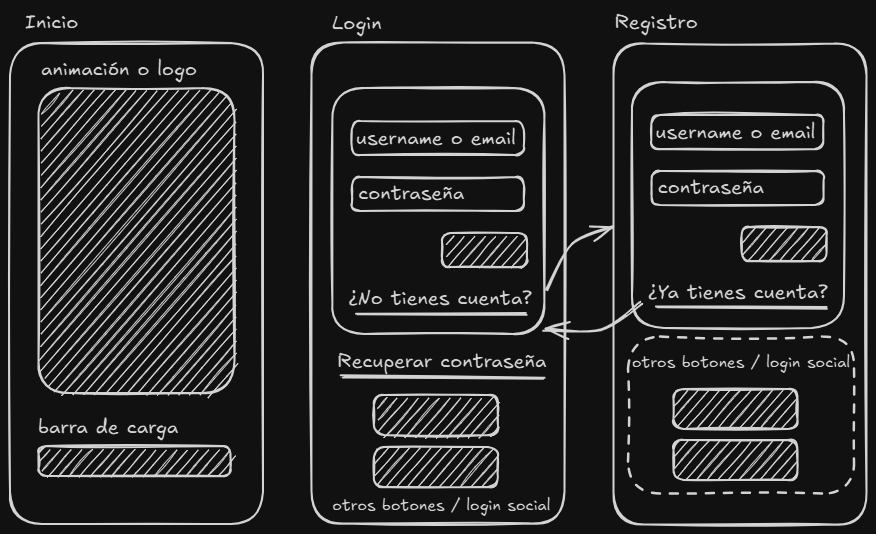
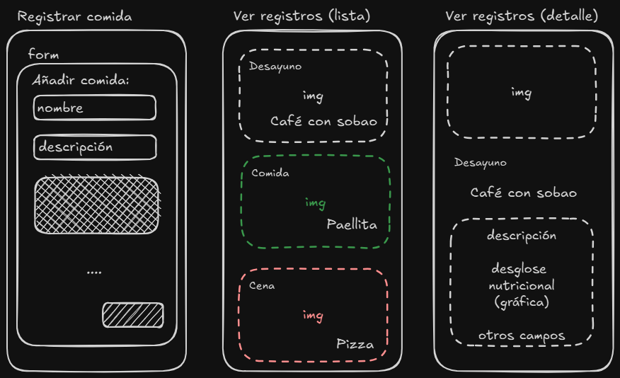
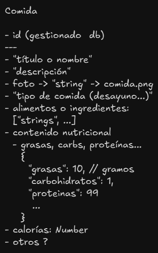

# App para llevar el control de la dieta

## Nombres propuestos

- -Kilos => +- Kilos
- Salud++
- MisDietas

---

### 1. Definición y Planificación de la App

- [✅] Elegir el tema de la app => ¿de qué trata la app? (ej. contar calorías de las comidas)

Es una app para controlar la dieta, ya sea para subir o bajar de peso, y los nutrientes de la comida.

Podríamos conectar al API de ChatGPT o similar para conseguir una evaluación de la comida.

También podríamos usar las APIs de OpenAI (Deepseek) para pedir datos con el tipo de formato necesario para nuestra app.

- [✅] Definir los objetivos y funcionalidades principales => (ej. el usuario se puede registrar, puede iniciar sesión y personalizar su perfil. Puede subir el detalle de su dieta...)

#### User stories

##### Registro y Login

- El usuario se puede registrar => email o username, contraseña
    - Edad, sexo, nivel de actividad ...
- El usuario registrado puede iniciar sesión

###### Usuarios logeados

- Puede ver su perfil
- Puede editar su perfil
- Puede registrar comidas
- Puede ver las comidas registradas => lista, vista individual

---

- [✅] Investigar el mercado y la competencia => ¿Hay más apps similares en las que nos podamos inspirar?

- [MyFitnessPal](https://www.myfitnesspal.com/es): tiene registro de alimentos y base de datos nutricional
- [Lose It](https://www.loseit.com/): se centra en bajar de peso y algunas funcionalidades más
- [Noom](https://www.noom.com/): es solo de pago, hacen un cuestionario **bastante largo** al inicio.

- [✅] Crear un brief de diseño => puedes usar la herramienta de diseño que gustes o maquetar algunas pantallas con código

Pantallas iniciales de la aplicación:

- Animación con barra de progreso
- Formulario de login
- Formulario de registro



Pantallas para el usuario logeado:

- Registrar comida
- Ver lista de comidas registradas
- Ver detalle de una de las comidas registradas



- Esquema del objeto comida:



### 2. Identidad Visual

- [✅] Seleccionar la paleta de colores => se recomienda entre 3 y 5 colores. Si no lo tienes claro, déjalo en blanco y negro primero y después elige un color primario y/o uno secundario.

- primario: `#00FF56`
- `#00CE46`
- `#60FE96`
- secundario: `#505050`
- background por defecto: `ffffff`

```css
:root {
  --primary-color: #00ff56;
  --default-color: #505050;
  /* espacios, tamaños de fuente... */
}
/* Ejemplo de uso: */
h2 {
    color: var(--default-color);
}
.primary-btn {
    background-color: var(--primary-color);
    color: var(--default-color);
}
```

- [✅] Diseñar o elegir un logo representativo => puedes hacer un logo o usar uno ya hecho que adaptes a tu app. En páginas como ésta puedes encontrar ideas: https://www.svgrepo.com/

- Opciones de logo y favicon:


- [ ] Seleccionar las fuentes y tipografías => Elige un par de fuentes al menos, una para títulos y otra para el texto de la página. Consulta páginas similares a https://fonts.google.com/

- Montserrat -> adaptable a weight desde 100 hasta 900

```html
    <link rel="preconnect" href="https://fonts.googleapis.com">
    <link rel="preconnect" href="https://fonts.gstatic.com" crossorigin>
    <link href="https://fonts.googleapis.com/css2?family=Montserrat:ital,wght@0,100..900;1,100..900&display=swap" rel="stylesheet">
```

- Se puede combinar con Roboto, Open Sans...

### 3. Diseño de la Interfaz y Pantallas

- [ ] Listar las pantallas básicas (inicio, registro, perfil, etc.) => puedes usar un documento de Google o un README en Github
- [ ] Crear wireframes (recomendación: Figma, Excalidraw) => puedes hacerlo con herramientas que sepas usar o con herramientas web (https://excalidraw.com/) o código


- [ ] Elaborar mocks de alta fidelidad => mejora la calidad de las pantallas anteriores => puedes hacerlo con herramientas que sepas usar o con herramientas web (https://excalidraw.com/) o código

- [ ] 


### 4. Prototipado y Validación

- [ ] Desarrollar un prototipo interactivo => añade alguna animación con CSS o JS
- [ ] Realizar pruebas de usabilidad con usuarios => comparte la app en clase y explica cómo funciona
- [ ] Recoger feedback y ajustar el diseño => ¿qué puedes mejorar en tu app?
