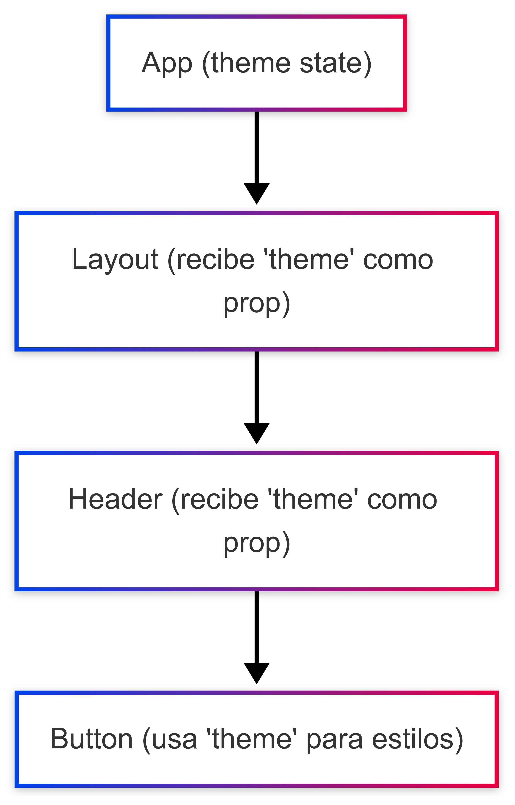
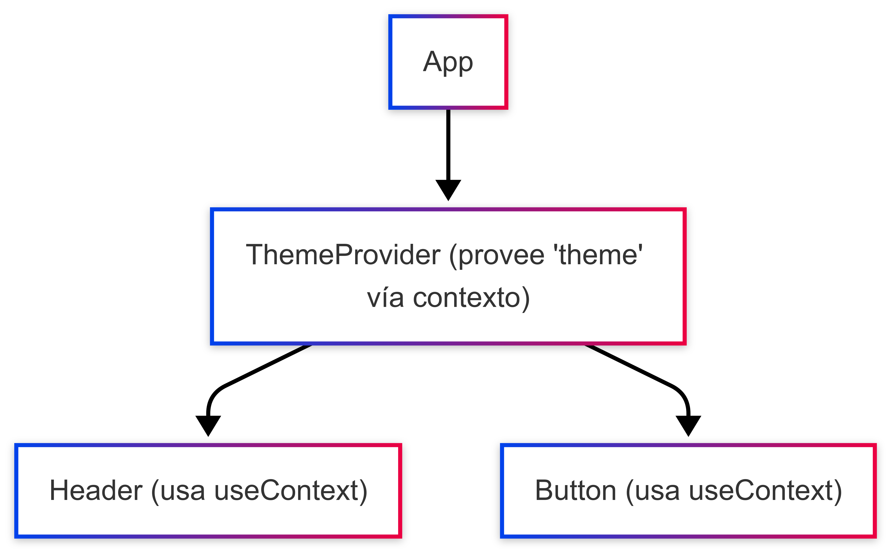

# 📘 useContext en React con ejemplos prácticos

`useContext` permite acceder a valores globales sin tener que pasar props manualmente.

---

## 🧠 1. Crear y consumir un contexto

```jsx
import React, { createContext, useContext } from "react";

// 1. Crear el contexto
const TemaContext = createContext("light");

function Boton() {
  const tema = useContext(TemaContext);
  return <button className={tema}>Soy un botón en modo {tema}</button>;
}

// 2. Consumir el contexto
export default function App() {
  return (
    <TemaContext.Provider value="dark">
      <Boton />
    </TemaContext.Provider>
  );
}
```

## 🎓 2. Contexto con objetos

```jsx
import React, { createContext, useContext } from "react";

const UsuarioContext = createContext(null);

function Perfil() {
  const usuario = useContext(UsuarioContext);
  return (
    <div>
      <p>Hola, {usuario.nombre}</p>
    </div>
  );
}

export default function App() {
  const usuario = { nombre: "César", rol: "admin" };

  return (
    <UsuarioContext.Provider value={usuario}>
      <Perfil />
    </UsuarioContext.Provider>
  );
}
```

## 💼 3. Tema global con botón para cambiar (con useState)

```jsx
import React, { createContext, useContext, useState } from "react";

const TemaContext = createContext();

function Boton() {
  const { tema, toggle } = useContext(TemaContext);
  return (
    <button onClick={toggle}>
      Cambiar a modo {tema === "dark" ? "light" : "dark"}
    </button>
  );
}

export default function App() {
  const [tema, setTema] = useState("light");
  const toggle = () => setTema((prev) => (prev === "light" ? "dark" : "light"));

  return (
    <TemaContext.Provider value={{ tema, toggle }}>
      <h2>Modo actual: {tema}</h2>
      <Boton />
    </TemaContext.Provider>
  );
}
```

### 📌 Notas clave

`useContext` consume un contexto creado con createContext.

- Solo funciona dentro de un `Context.Provider`.

- Útil para:

  - Temas (dark/light)
  - Usuario autenticado
  - Configuración global
  - Idioma

-> **tl;dr:** `useContext` evita el "prop drilling" (pasar props por muchas capas).

---

#### Theme con prop drilling



```jsx
import React, { useState } from 'react';
import ReactDOM from 'react-dom/client';

function Button({ theme }) {
  return (
    <button
      style={{
        padding: '10px',
        backgroundColor: theme === 'dark' ? '#333' : '#eee',
        color: theme === 'dark' ? '#fff' : '#000',
      }}
    >
      Soy un botón ({theme})
    </button>
  );
}

function Header({ theme }) {
  return (
    <header>
      <h1>Header</h1>
      <Button theme={theme} />
    </header>
  );
}

function Layout({ theme }) {
  return (
    <main>
      <Header theme={theme} />
    </main>
  );
}

function App() {
  const [theme, setTheme] = useState('light');

  const toggleTheme = () =>
    setTheme((prev) => (prev === 'light' ? 'dark' : 'light'));

  return (
    <div>
      <h1>Prop Drilling Example</h1>
      <button onClick={toggleTheme}>
        Cambiar a {theme === 'light' ? 'dark' : 'light'}
      </button>
      <Layout theme={theme} />
    </div>
  );
}

const root = ReactDOM.createRoot(document.getElementById('root'));
root.render(<App />);
```

#### Theme con Context



```jsx
import React, { createContext, useContext, useState } from 'react';
import ReactDOM from 'react-dom/client';

// 1. Crear contexto
const ThemeContext = createContext();

// 2. Hook personalizado (opcional pero limpio)
const useTheme = () => useContext(ThemeContext);

// 3. Componente Button que consume el contexto
function Button() {
  const { theme } = useTheme();

  return (
    <button
      style={{
        padding: '10px',
        backgroundColor: theme === 'dark' ? '#333' : '#eee',
        color: theme === 'dark' ? '#fff' : '#000',
      }}
    >
      Soy un botón ({theme})
    </button>
  );
}

// 4. Header también usa el contexto
function Header() {
  return (
    <header>
      <h1>Header</h1>
      <Button />
    </header>
  );
}

// 5. Layout no necesita saber del tema
function Layout() {
  return (
    <main>
      <Header />
    </main>
  );
}

// 6. App que provee el contexto
function App() {
  const [theme, setTheme] = useState('light');
  const toggleTheme = () => {
    setTheme((prev) => (prev === 'light' ? 'dark' : 'light'))
    };

  return (
    <ThemeContext.Provider value={{ theme }}>
      <h1>Context API Example</h1>
      <button onClick={toggleTheme}>
        Cambiar a {theme === 'light' ? 'dark' : 'light'}
      </button>
      <Layout />
    </ThemeContext.Provider>
  );
}

const root = ReactDOM.createRoot(document.getElementById('root'));
root.render(<App />);
```
