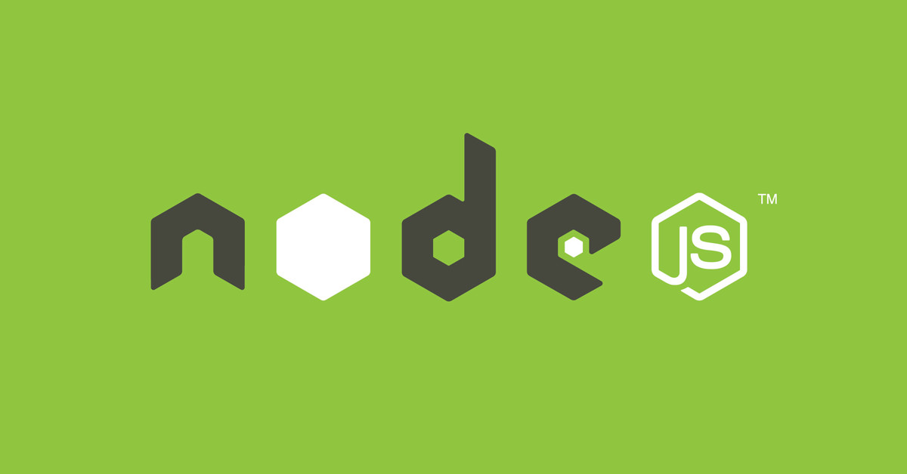

**1. Introducción a Node.js y Express**



**1.1 ¿Qué es Node.js?**

Node.js es un entorno de ejecución de JavaScript basado en el motor V8 de Chrome. Permite ejecutar código JavaScript en el servidor, ofreciendo un modelo de E/S asíncrono y basado en eventos que lo hace eficiente y escalable.

**1.2 ¿Qué es Express?**


Express es un framework minimalista para Node.js que facilita la creación de aplicaciones web y APIs. Proporciona:

* Enrutamiento sencillo.
* Middleware configurable para gestionar peticiones y respuestas.
* Integración con motores de plantilla y otras librerías.

**1.3 Estructura típica de un proyecto Express**

```bash
mi-api/
├── package.json
├── app.js (o index.js)
├── routes/
│   └── usuarios.js
├── controllers/
│   └── usuariosController.js
└── middlewares/
    └── auth.js
```

**2. Fundamentos de SQL**

Para conectar a bases de datos relacionales, conviene entender las siguientes operaciones básicas de SQL:

* **CREATE TABLE**: definir la estructura de una tabla.
* **INSERT**: agregar filas.
* **SELECT**: consultar datos con filtros (`WHERE`), orden (`ORDER BY`) y paginación (`LIMIT`).
* **UPDATE**: modificar filas existentes.
* **DELETE**: eliminar filas.

*Ejemplo básico:*

```sql
-- Cread un archivo db.sqlite
-- Usando la extensión SQLite
-- Cread un archivo create_table.sql
-- Ejecutad "Run Query" con este archivo
CREATE TABLE usuarios (
  id INTEGER NOT NULL PRIMARY KEY,
  nombre VARCHAR(100) NOT NULL,
  email VARCHAR(100) UNIQUE NOT NULL
);
-- Ejecutad "Run Query" con este archivo
-- insertar usuario:
INSERT INTO usuarios (nombre, email) VALUES ('Ana', 'ana@example.com');

SELECT * FROM usuarios WHERE email LIKE '%@example.com';
UPDATE usuarios SET nombre = 'Ana Pérez' WHERE id = 1;
DELETE FROM usuarios WHERE id = 1;
```

**Extensiones SQLite**
- **SQLite:** alexcvzz.vscode-sqlite
- **SQLite Viewer:** qwtel.sqlite-viewer

**3. ORM Sequelize**

Sequelize es un ORM para Node.js que abstrae SQL en modelos JavaScript y facilita cambiar entre proveedores (MySQL, Postgres, SQLite, etc.).

**3.1 Instalación y configuración**

```bash
npm install sequelize sequelize-cli mysql2  # o pg y pg-hstore para Postgres
```

Crear `config/config.js` con entornos:

```js
module.exports = {
  development: {
    dialect: 'mysql',
    host: 'localhost',
    database: 'mi_db',
    username: 'root',
    password: ''
  },
  test: { /* similar */ },
  production: { /* similar */ }
};
```

**3.2 Definir un modelo**

```bash
npx sequelize-cli model:generate --name Usuario --attributes nombre:string,email:string
```

Esto crea migración y modelo en `/models/usuario.js`:

```js
module.exports = (sequelize, DataTypes) => {
  const Usuario = sequelize.define('Usuario', {
    nombre: DataTypes.STRING,
    email: DataTypes.STRING
  });
  return Usuario;
};
```

**3.3 Migraciones**
Ejecutar migraciones:

```bash
npx sequelize-cli db:migrate
```

**3.4 Operaciones CRUD con Sequelize**

* **Crear**: `Usuario.create({ nombre, email })`
* **Leer**: `Usuario.findAll()`, `Usuario.findByPk(id)`
* **Actualizar**: `usuario.update({ nombre: 'Nuevo' })`
* **Eliminar**: `usuario.destroy()`

**4. Laboratorios**

- [Labs 1: API REST CRUD con Express (sin BD)](./labs/1.api_crud.md)
- [Labs 2: Conexión a Base de Datos con Sequelize](./labs/2.sequelize.md)
- [Labs 3: Cambio de Provider y Consultas Avanzadas](./labs/3.providers.md)
- [Lab 4: Autenticación con JWT y Refresh Tokens](./labs/4.login_service.md)
- [Lab 5: Blog con Posts y Categorías](./labs/5.blog.md)
- [Lab 6: Dashboard en React para el Blog](./labs/6.dashboard.md)

---

**5. Recursos adicionales**

* Documentación Node.js: [https://nodejs.org](https://nodejs.org)
* Guía Express: [https://expressjs.com](https://expressjs.com)
* Sequelize Docs: [https://sequelize.org](https://sequelize.org)

¡Buen trabajo y éxito en tus labs!
