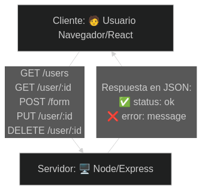

# Servidor de Node con Express

> Recibe cualquier `POST`* por un endpoint y lo muestra por consola. El response 
tarda una cantidad variable de tiempo para simular un asincronía de un servicio 
real

[*] Ver explicación de método POST a continuación 👇

---

## 🌐 Introducción a los métodos HTTP básicos

Cuando una aplicación web (como React) necesita enviar o recibir datos de un 
servidor, utiliza métodos **HTTP**. Cada método tiene un propósito específico:

**Método** / **Uso común**

- `GET`:    Solicitar datos (leer). No cambia nada en el servidor.
- `POST`:   Enviar datos para crear algo (como un formulario).
- `PUT`:    Actualizar un recurso existente (reescribirlo).
- `PATCH`:  Actualizar parcialmente un recurso.
- `DELETE`: Eliminar un recurso.

**Ejemplo:**

> Cuando enviamos un formulario desde React, normalmente usamos `POST` para enviar 
los datos al servidor.

También es importante que si el servidor y React están en puertos diferentes 
(por ejemplo, React en el `3000` y el servidor en el `4000`), se necesita permitir 
que ambos puedan comunicarse. Esto se logra con **CORS** (Cross-Origin Resource 
Sharing), que ya hemos configurado en el servidor Express.




## 🛠 Cómo usarlo

Instala las dependencias:

```bash
npm init -y # solo si no hay `package.json`
npm install express cors
```

Ejecuta el servidor:

```bash
node server.js
```

Puedes configurar el delay con variables de entorno:

```bash
MIN_DELAY_MS=300 MAX_DELAY_MS=1000 node server.js
```

## ⚡ CORS

El middleware `cors()` está habilitado para permitir que cualquier cliente 
(React en otro puerto, como el 3000) pueda enviar peticiones sin restricciones. 

Si luego quieres limitarlo solo a `localhost:3000` puedes hacer:

```javascript
app.use(cors({ origin: 'http://localhost:3000' }));
```

## 🧪 Prueba rápida con curl:

```bash
curl -X POST http://localhost:4000/form \
-H "Content-Type: application/json" \
-d '{"nombre":"Pepe","email":"pepe@frog.com"}'
```
