## **Mini Proyecto: Rediseño de una App o Web Local**

### **Objetivo**

Rediseñar en equipos de 3-4 personas la interfaz de una app o web conocida (puede ser real o simulada) aplicando principios de UX/UI básicos: jerarquía visual, accesibilidad, coherencia, y usabilidad.

### **Duración estimada**

* **Día 1 (4h)**: análisis + wireframe
* **Día 2 (4h)**: mockup + presentación

---

### **Fases del proyecto**

#### 1. **Selección del caso**

Elegir en grupo una aplicación sencilla:

* Una app municipal

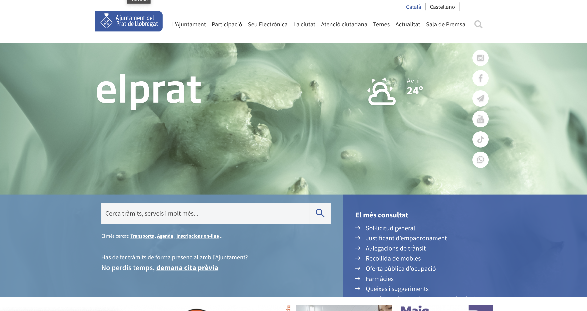

* Una web educativa local

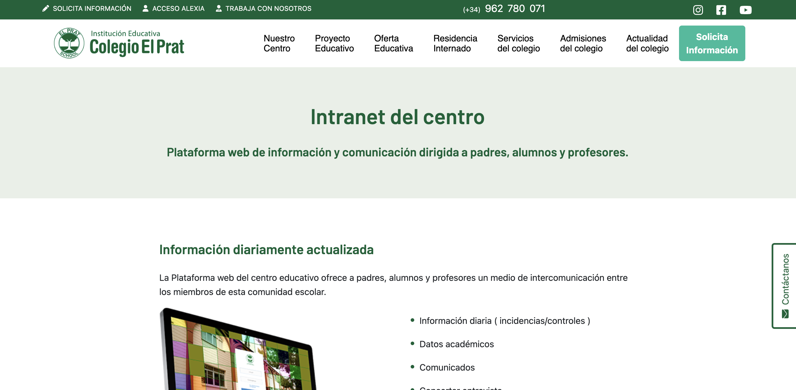

* Una app de transporte público

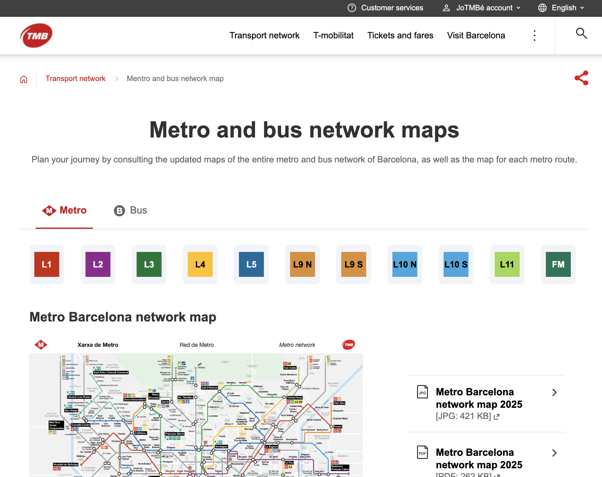

* Una tienda online pequeña

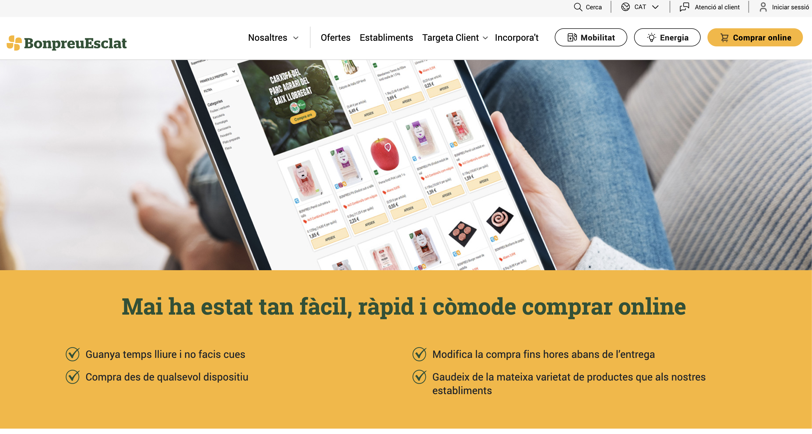

#### 2. **Análisis UX**

* ¿Qué problemas tiene la interfaz actual?
    * ¿Cómo podrías resolver ese problema?
* ¿Qué funcionalidades son confusas o inaccesibles?
    * ¿Cómo podrías resolver ese problema?
* ¿Qué tipo de usuario usa esta app?
    * ¿Cómo podrías adaptar la interfaz para él/ella?

#### 3. **Wireframe (boceto)**

* Usar papel o Figma (según nivel/experiencia)
* Proponer una estructura más clara: navegación, botones, jerarquía

#### 4. **Mockup**

* Diseñar una o dos pantallas claves en Figma o herramienta que usen (puede ser Canva o pen+papel si no hay recursos). Alternativa: Excalidraw o similar

#### 5. **Presentación**

* Cada grupo explica su elección, problemas detectados, y decisiones de rediseño
* En 5-10 minutos por grupo
* Cada alumno/a debe hablar y explicar una parte

---

### **Material de apoyo**

* Ejemplos de interfaces buenas y malas 

- Ejemplo con cartel de horarios de parking:

❌ 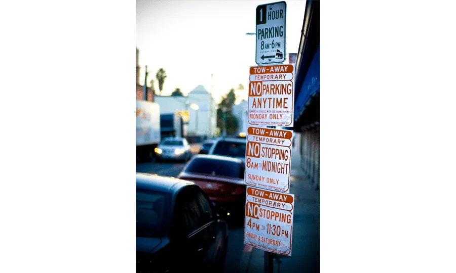

✅ 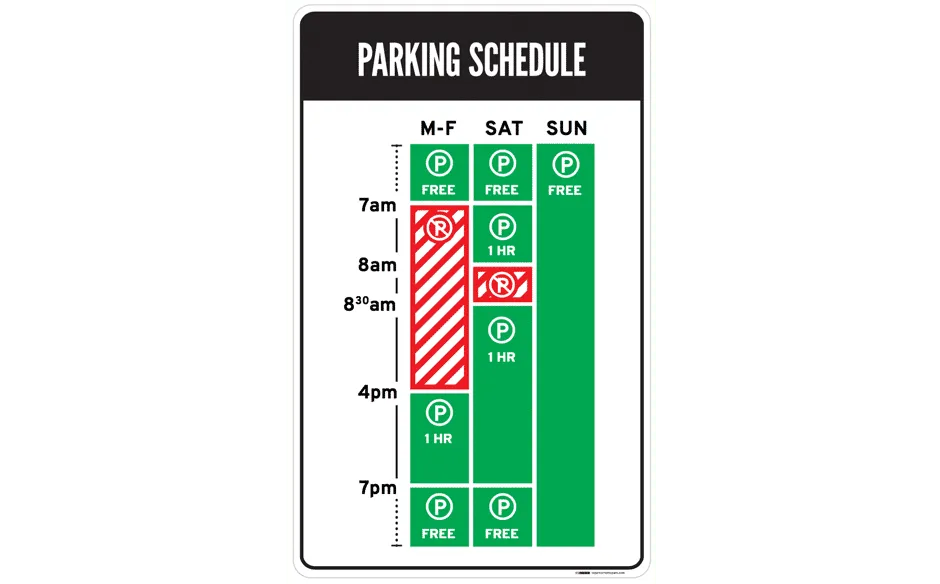

---

- Ejemplo con tienda de gafas:

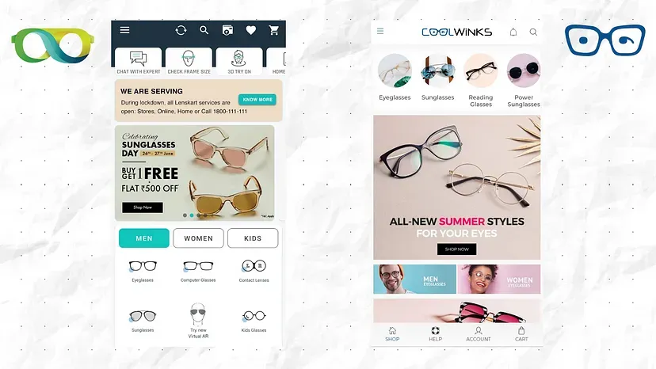

---

- Ejemplo de contador de calorías bien explicado:

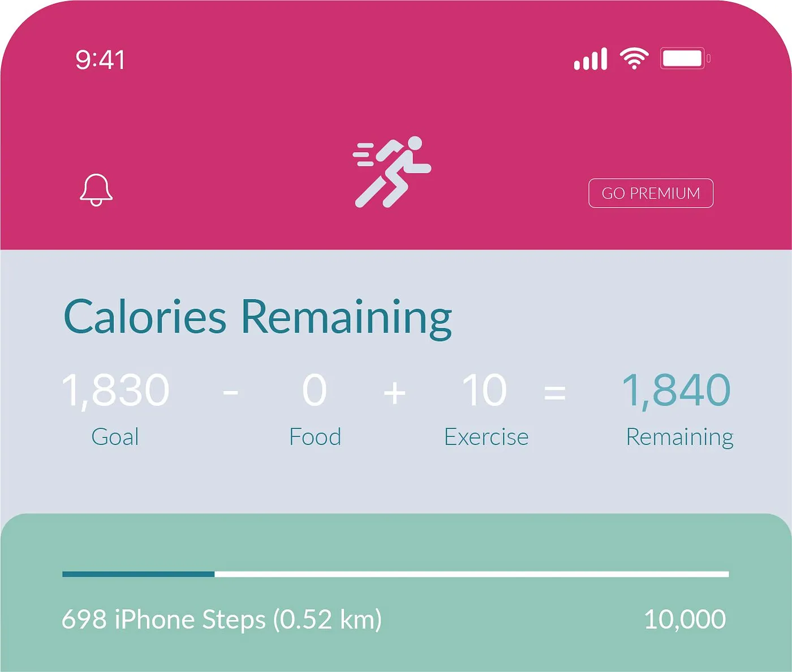

---

- Ejemplo de botón con y sin animación al clicar:

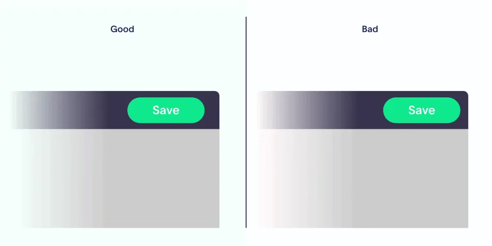

---

- Ejemplo de texto en botón:

---

- Ejemplo de jerarquía comunicada visualmente:

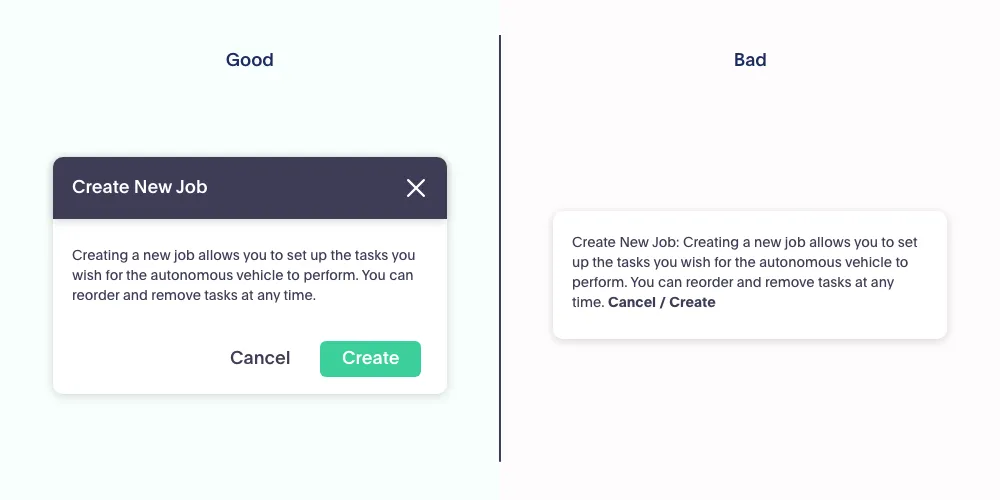

---

- Ejemplo de dropdown:

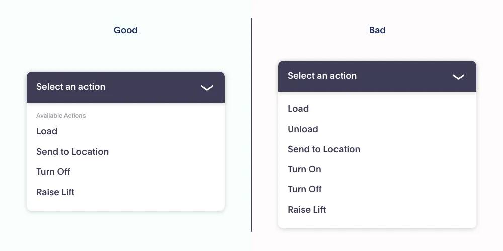

---

- Ejemplo de feedback en form:

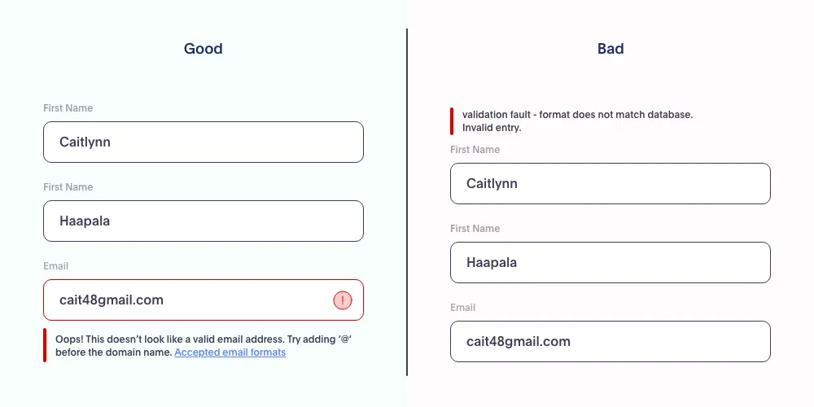

---

- La importancia de adaptar el contenido al medio:

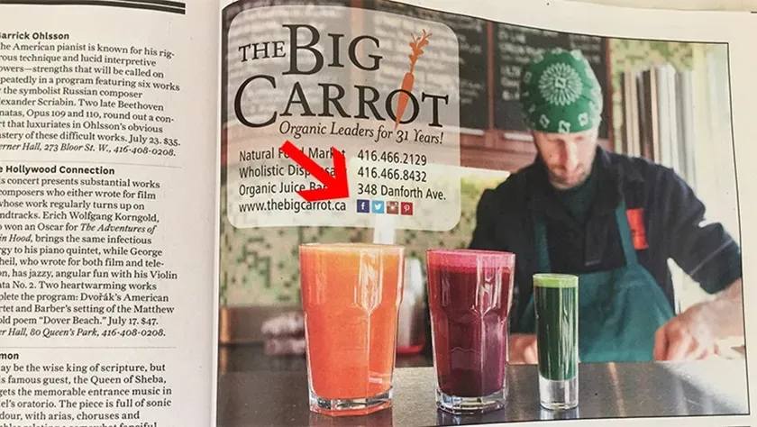

---

- La importancia de indicar para donde se abre algo:

[Post original](https://careerist.medium.com/good-vs-bad-design-10-examples-fb2b388c4bdb)

Claro, aquí tienes ambos elementos convertidos en listas de bullets **accionables** para que los alumnos puedan usarlos fácilmente durante el diseño:

---

### ✅ Fichas con principios UX/UI básicos

* [ ] **Alineación**: Asegúrate de que los elementos estén correctamente alineados entre sí (por ejemplo, títulos con texto, botones con formularios).
* [ ] **Espaciado**: Usa márgenes y padding consistentes para evitar amontonamiento y mejorar la legibilidad.
* [ ] **Colores**:

  * [ ] Usa una paleta limitada (3-5 colores principales).
  * [ ] Aplica suficiente contraste entre texto y fondo.
  * [ ] Usa colores consistentes para acciones iguales (por ejemplo, siempre el mismo color para los botones primarios).
* [ ] **Tipografía**:

  * [ ] Elige como máximo 2 familias tipográficas.
  * [ ] Usa tamaños jerárquicos (título, subtítulo, texto normal).
  * [ ] Asegúrate de que el texto sea legible en todos los dispositivos.

---

### 🔍 Lista de verificación rápida para evaluar un diseño

* [ ] **¿Tiene jerarquía visual clara?**

  * Los títulos destacan sobre los subtítulos y el texto.
  * Los botones principales llaman más la atención que los secundarios.
* [ ] **¿Es accesible para todos los usuarios?**

  * Usa texto alternativo en imágenes.
  * Asegura contraste alto entre texto y fondo.
  * Asegura que pueda navegarse con teclado.
* [ ] **¿Hay coherencia visual?**

  * Colores, tipografías y botones mantienen el mismo estilo en todo el sitio.
  * Los iconos tienen el mismo estilo visual.
  * El espaciado y márgenes se repiten de forma coherente.

---

### Plantilla Presentación

# 🧑‍💻 Presentación del Proyecto UX/UI

## 1. 🎯 Nombre del Proyecto
> Ejemplo: "Rediseño de la web de la Biblioteca Municipal"

---

## 2. 🧩 ¿Qué problema queremos resolver?
- ¿Qué fallos o debilidades tenía la interfaz original?
- ¿Qué necesidad detectamos en los usuarios?

---

## 3. 👥 Público objetivo
- ¿A quién va dirigido este rediseño?
- Breve descripción de la persona usuaria (edad, nivel digital, necesidades, etc.)

---

## 4. 🛠️ Proceso de diseño
### 🔍 Investigación inicial
- ¿Qué observamos en la interfaz original?
- ¿Qué feedback recibimos?

### ✏️ Wireframe
- Breve descripción del esquema o estructura planteada.
- Imagen (si está disponible).

### 🧪 Mockup
- ¿Cómo quedó visualmente?
- Imagen o enlace (si lo hicieron en Figma/Canva u otra herramienta).

---

## 5. ✅ Principios aplicados
Marca los que habéis aplicado (puedes borrar los que no):

- [x] Alineación visual clara
- [x] Espaciado adecuado
- [x] Buena jerarquía visual
- [x] Accesibilidad (contrastes, texto alternativo…)
- [x] Tipografía legible
- [x] Coherencia de estilo
- [x] Responsive / diseño adaptable

---

## 6. 💡 Cosas que hemos aprendido
- …
- …
- …

---

## 7. 🔄 Próximos pasos (si tuviéramos más tiempo)
- ¿Qué mejoraríais si tuvierais otro día de trabajo?

---

## 8. 📸 Imagen final del rediseño
*(Pegar aquí una captura del diseño final o prototipo)*

---

## 9. 🗣️ Presentado por
- Nombre del equipo
- Nombres de los integrantes

