# 🎨 Introducción al Diseño de Interfaces de Usuario (UI)

## ¿Qué es el diseño UI?

El **Diseño de Interfaces de Usuario (UI)** se centra en el aspecto visual y la interacción del usuario con un producto digital: botones, menús, tipografías, colores, iconos, animaciones, etc.

> Mientras que el UX se preocupa por cómo se siente una experiencia, el UI se ocupa de **cómo se ve** y **cómo se maneja**.

---

## UX vs UI: ¿en qué se diferencian?

| UX (Experiencia de Usuario)              | UI (Interfaz de Usuario)                    |
| ---------------------------------------- | ------------------------------------------- |
| Cómo funciona un producto                | Cómo luce un producto                       |
| Enfocado en la lógica y estructura       | Enfocado en el estilo visual                |
| Investigación, testeo, flujos de usuario | Tipografías, colores, botones, layout       |
| Busca resolver problemas                 | Busca generar atractivo y coherencia visual |

> 🧠 Piensa en una comida: UX es la receta, ingredientes y experiencia al comerla; UI es la presentación del plato.

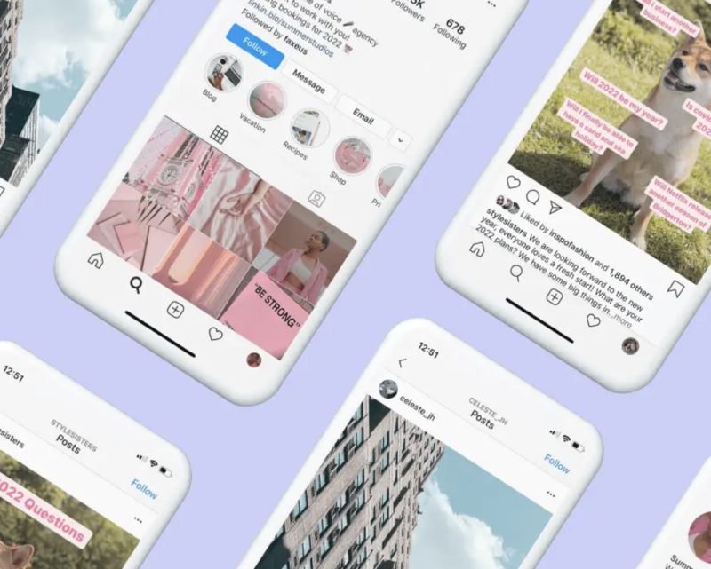

---

## Elementos clave del diseño UI

### 🎨 1. Tipografía

* Uso de fuentes legibles y jerarquía clara (títulos, subtítulos, cuerpo).
* Coherencia en tamaños y estilos (evitar demasiadas combinaciones).

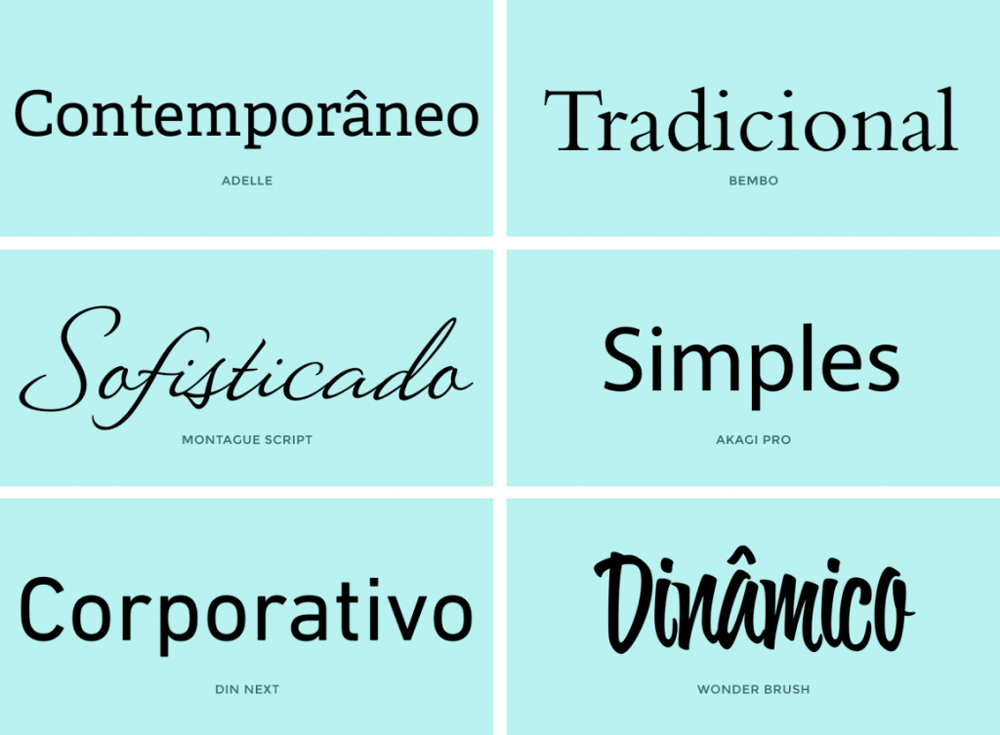

### 🎨 2. Paleta de colores

* Colores consistentes con la identidad visual de la marca.
* Uso inteligente del color para destacar botones, errores o notificaciones.
* Contraste adecuado para garantizar accesibilidad.

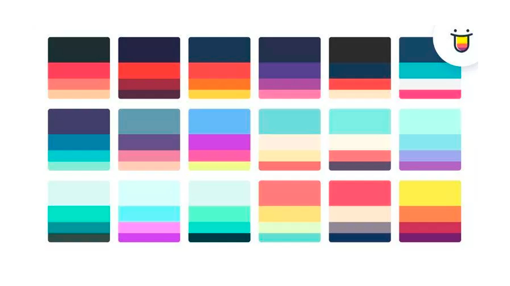

### 🎨 3. Botones y llamadas a la acción (CTA)

* Deben ser visualmente reconocibles e invitar a la interacción.
* Usar verbos de acción claros: "Comprar", "Enviar", "Descargar".

- Bootstrap
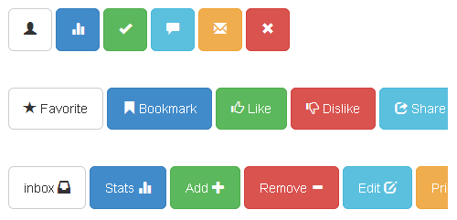

- Tailwindcss
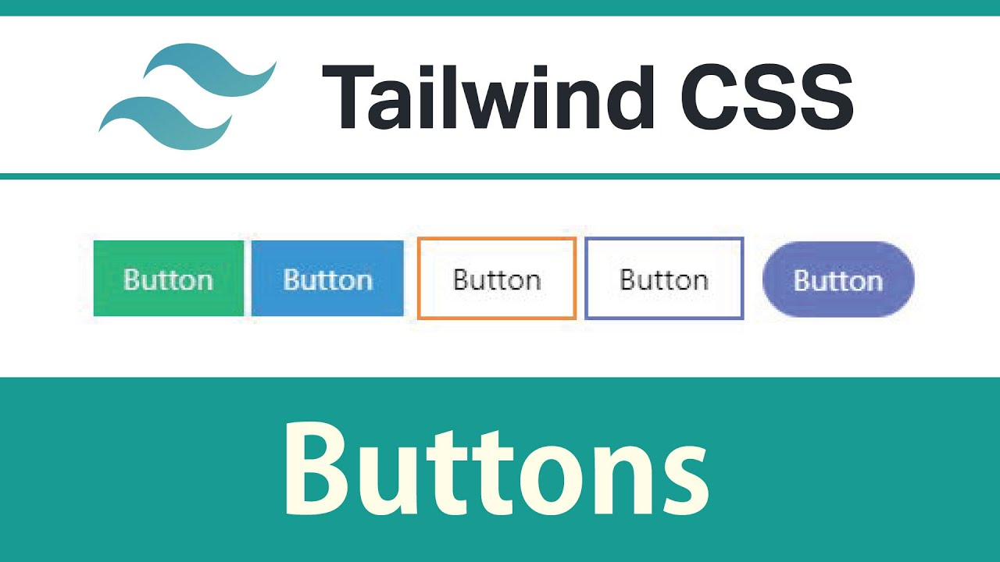

- @shadcn
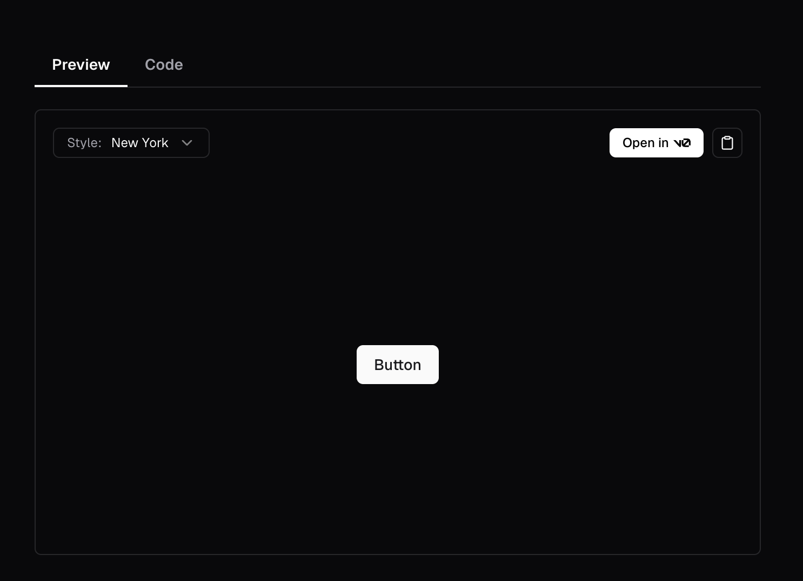

- [Button generator](https://www.cssbuttongenerator.com/)
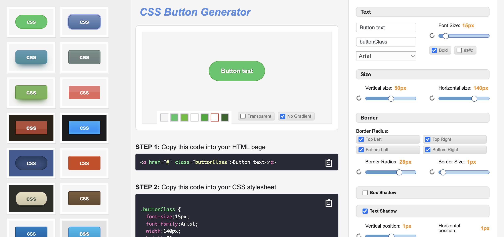

### 🎨 4. Iconografía

* Apoyo visual para la navegación.
* Deben ser intuitivos y coherentes en estilo.
* Acompañarlos de texto si hay posibilidad de ambigüedad.

- Heroicons

- Flaticon
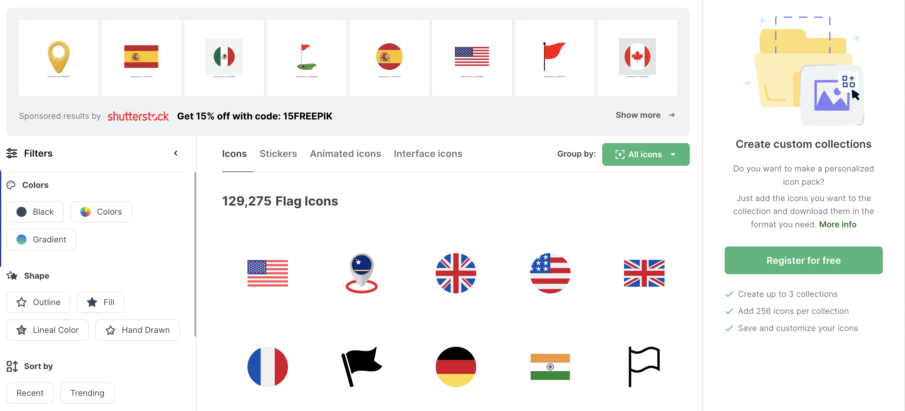

- MUI material icons
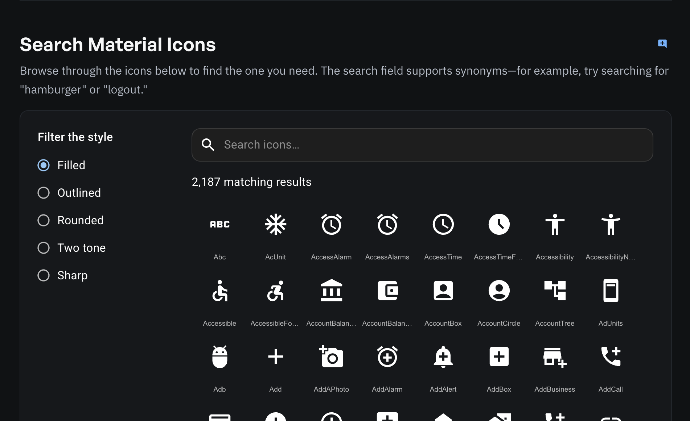

### 🎨 5. Espaciado y distribución

* Uso correcto de **white space** (espacio en blanco) para mejorar la legibilidad.
* Evitar el "ruido visual" y el exceso de elementos en pantalla.

> Rule of thumb: Nunca asumas que los espacios en blanco se van a comportar bien :)

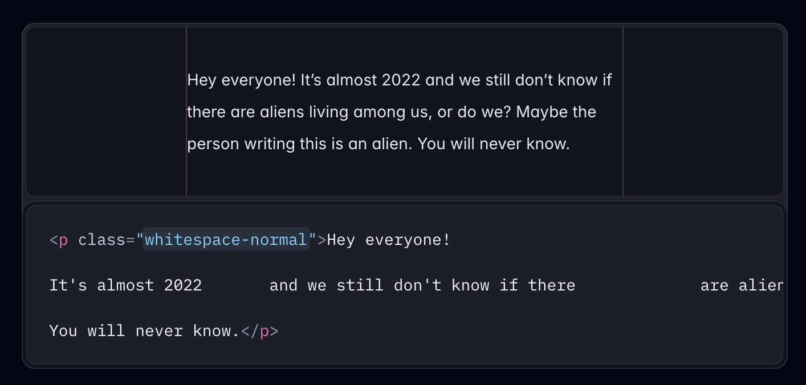

### 🎨 6. Diseño responsive

* Las interfaces deben adaptarse a distintos tamaños de pantalla (móvil, tablet, escritorio).
* Priorización de contenido según el dispositivo.

---

## Principios de un buen diseño UI

* **Consistencia**: mantener el mismo estilo visual en todo el producto.
* **Claridad**: los elementos deben ser fáciles de interpretar.
* **Feedback visual**: mostrar al usuario que su acción tuvo efecto (por ejemplo, al pulsar un botón).
* **Simplicidad**: eliminar elementos innecesarios que distraigan o confundan.
* **Accesibilidad**: pensar en todos los usuarios, incluidos los que usan teclados, lectores de pantalla o tienen dificultades visuales.

---

## UI en acción: ejemplos del mundo real

* **Apple**: interfaz limpia, minimalista, intuitiva.
* **Airbnb**: navegación clara, imágenes atractivas, tipografía coherente.
* **Spotify**: uso de colores llamativos, jerarquía visual fuerte, UI adaptada a distintos dispositivos.

- Apple
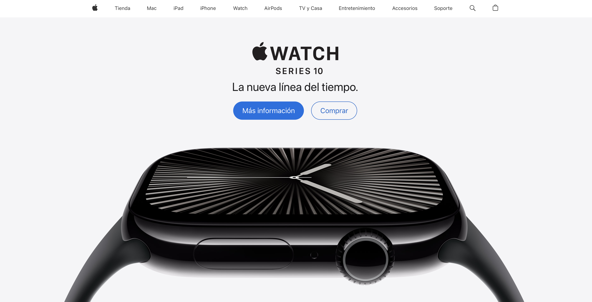

- Tesla 

- Spotify
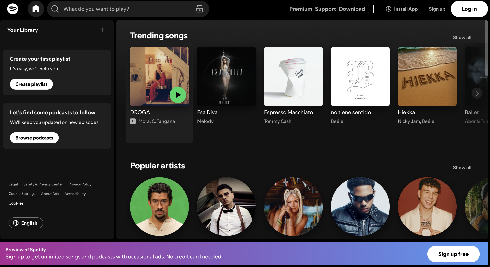

- Airbnb
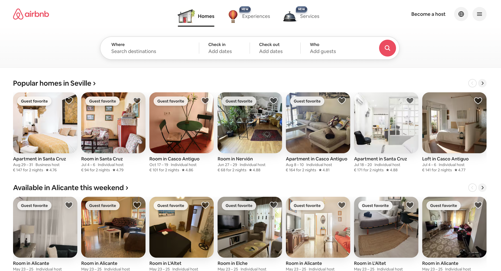

- etc.

---

## Herramientas comunes para diseño UI

* **Figma** (recomendado): diseño colaborativo y prototipado.
* **Adobe XD**: creación rápida de interfaces y prototipos.
* **Sketch**: ampliamente usado en entornos macOS.
* **Canva** (básico): ideal para iniciarse o hacer diseños rápidos.

---

## Conclusión

El diseño UI es más que “hacerlo bonito”. Se trata de construir **interacciones visuales efectivas**, que guíen al usuario y estén alineadas con el propósito del producto. Un buen diseño UI **complementa** al UX y juntos crean experiencias memorables y funcionales.
