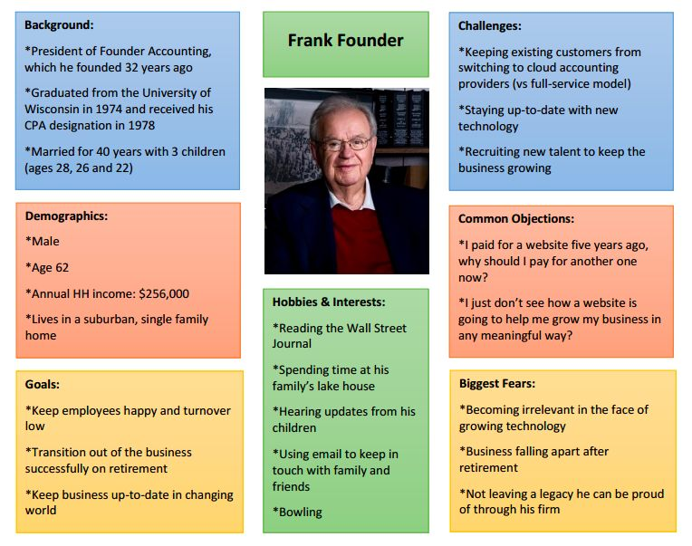
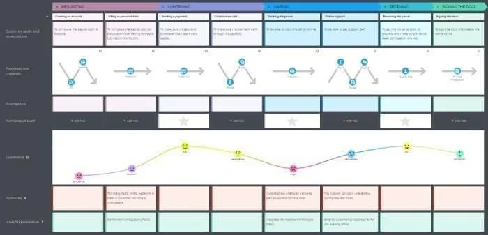
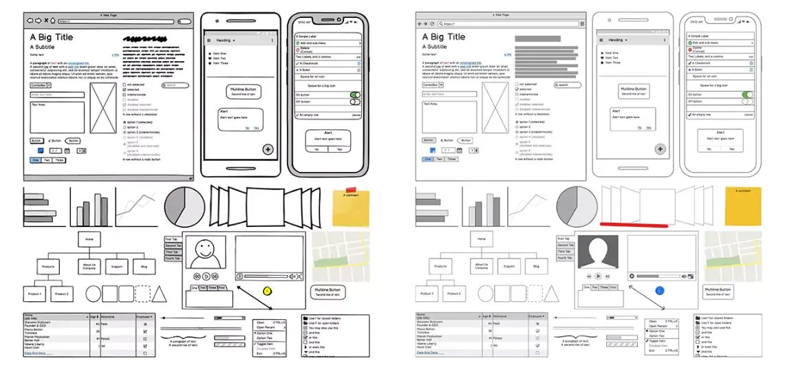
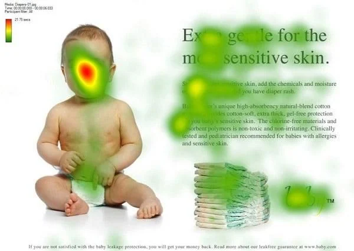
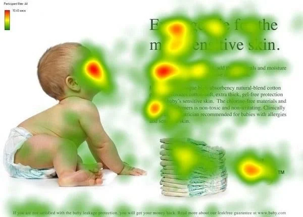

## 🌐 Enfoque holístico

> Become an holistic dev, my friend 🧠

El diseño UX debe abordarse de forma **integral**. Esto significa que hay que considerar toda la experiencia del usuario, desde el primer clic en el sitio web hasta la conversión final.

Aunque pueda parecer complejo, con **planificación y preparación**, el proceso se vuelve mucho más manejable.

---

## 👤 1. Persona de usuario y mapa de viaje

### 🔎 ¿Qué es una persona de usuario?

Una **persona de usuario** es una representación ficticia de un miembro del público objetivo. Se le asigna un nombre, una imagen y una historia de fondo, lo que facilita empatizar y diseñar pensando en sus necesidades.

> Ejemplo: “¿Este contenido sería útil para *Frank*?”
> “¿Cómo puedo facilitarle a *Frank* el acceso a esta sección?”

Puedes definir tantas personas como perfiles distintos tenga tu audiencia.

### 🗺️ ¿Qué es el mapa de viaje?

El **customer journey map** o **mapa de viaje del usuario** representa el recorrido típico que hace una persona dentro del sitio:

* ¿Dónde empieza?
* ¿Por dónde navega?
* ¿Dónde finaliza su recorrido?
* ¿Con qué puntos de contacto se relaciona (redes, soporte, etc.)?

> Ejemplo práctico:
> En una tienda online descubres que muchos usuarios abandonan antes de pagar. Al investigar, detectas que no quieren crear una cuenta. Solución: añades **compra como invitado** y las ventas aumentan.

---

## 🧱 2. Wireframes y prototipos

Antes de empezar a construir el sitio en tu CMS, es fundamental planificar la estructura.

### ✏️ Wireframe

* Boceto estático y básico de la disposición de la página.
* Permite decidir la ubicación de elementos y el flujo de navegación.

### 🧪 Prototipo

* Versión interactiva y funcional del sitio/app.
* Permite probar tareas básicas y recoger feedback del usuario.

> Beneficios:

* Visualizar la experiencia antes del desarrollo.
* Son económicos y fáciles de modificar.
* Puedes crearlos con herramientas como **Figma**, **Balsamiq**, **Photoshop**, o incluso a mano.

---

## 🎨 3. Diseño visual

Aunque el diseño gráfico forma parte del UI, también influye en la experiencia general del usuario.

Una web debe ser **funcional**, pero también **agradable visualmente** y coherente con la marca.

### 💡 Recomendaciones:

* Usa un número limitado de **fuentes**, **colores** y **tamaños** (3 de cada uno es ideal).
* Asegura la buena visualización tanto en escritorio como en móvil.
* Aplica **espacio en blanco** entre elementos para facilitar la lectura.
* Mantén **coherencia visual** con otras páginas y materiales de marketing.
* **Testea** tu diseño visual con usuarios reales.

---

## 📈 4. Cómo monitorizar y optimizar el UX

UX no es una tarea puntual. Es un proceso **continuo** que debe adaptarse y mejorarse con el tiempo.

> Si la tasa de conversión baja o sube el rebote, puede ser momento de revisar la experiencia de usuario.

---

## 🎯 5. Crea una estrategia UX alineada con los objetivos

Una **estrategia UX clara** ayuda a:

* Definir prioridades
* Coordinar al equipo
* Mantener coherencia

### Componentes esenciales de una estrategia UX:

1. **Objetivos claros**: ¿quieres vender más, fidelizar, reducir consultas?
2. **Conocimiento del usuario**: encuestas, test online, entrevistas.
3. **Análisis de la competencia**: ¿qué hacen bien?, ¿cómo te diferencias?
4. **Mapa del viaje del usuario**: rutas, obstáculos y oportunidades.
5. **Roles definidos**: ¿quién diseña, desarrolla, analiza?
6. **Métodos de evaluación**: A/B testing, feedback directo, métricas.
7. **Revisión constante**: tus usuarios, tecnología y producto cambian. ¡Tu UX también debe evolucionar!

---

## 📊 6. Métricas clave para medir la experiencia

### Métricas cuantitativas:

* ⏱️ **Tiempo en página**
* 📄 **Número de páginas visitadas**
* ✅ **Tasa de conversión**

### Métricas cualitativas:

* 🧑‍💬 **Feedback directo** (encuestas, entrevistas)
* 🧪 **Tests de usabilidad** (tareas observadas)
* 🔥 **Mapas de calor** y **eye tracking** (elementos más vistos/clicados)

> 🍼 Ejemplo curioso: en un anuncio, los usuarios miraban a un bebé y no al texto. Cuando el bebé miraba al texto, los usuarios también lo hacían. ¡El diseño visual afecta la atención!

---

## 🧪 7. Test A/B

El **A/B Testing** permite comparar dos versiones de una misma página para ver cuál funciona mejor.

### Pasos para realizar un test A/B:

1. Crea 2 versiones de la página (solo cambia un elemento).
2. Muestra cada versión a la mitad de los usuarios.
3. Analiza los resultados (clics, conversiones, permanencia).
4. Quédate con la mejor.
5. Repite con nuevas variaciones.

