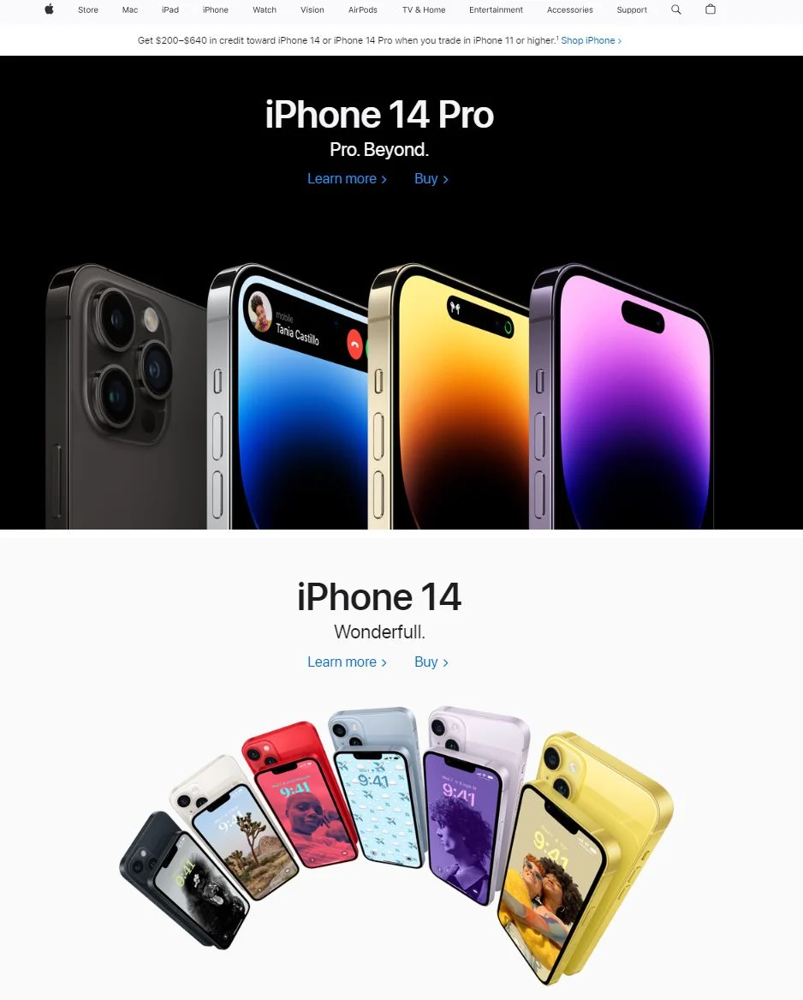
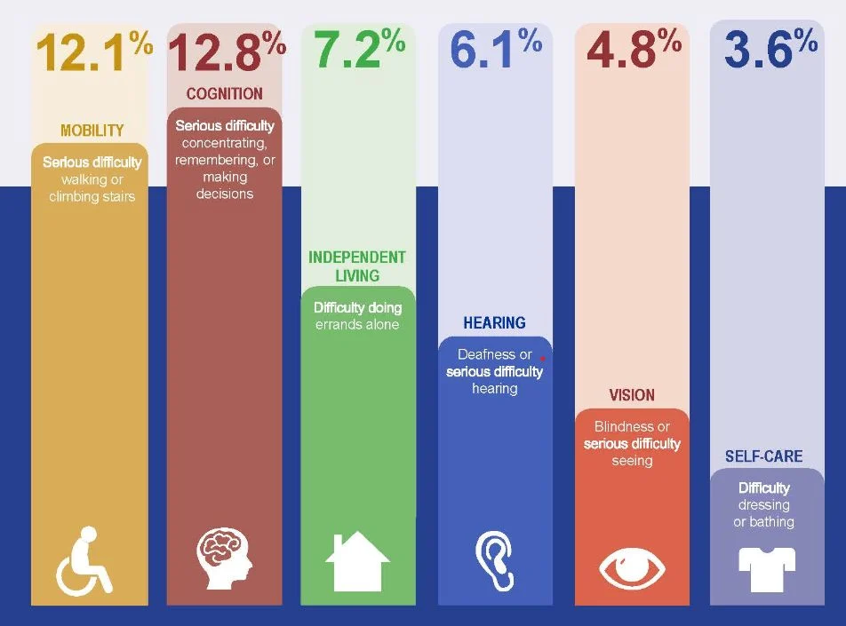
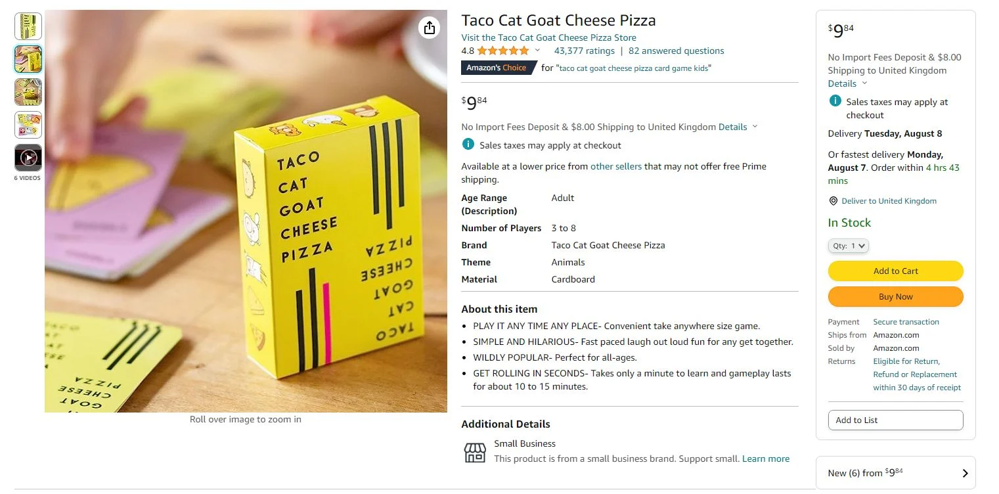
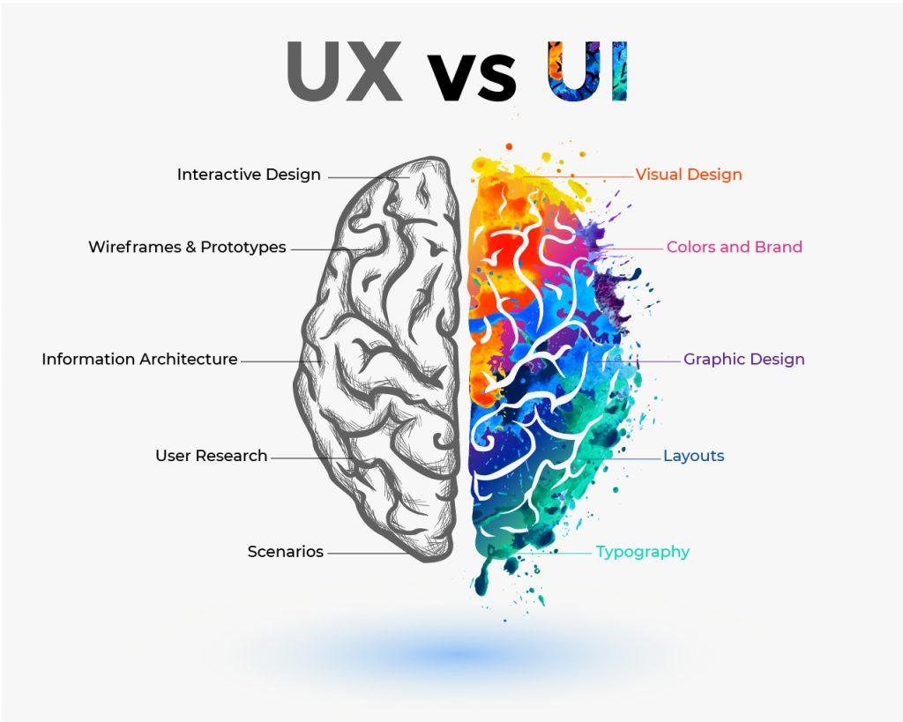

# 🧠 Introducción al Diseño de Experiencia de Usuario (UX)

## ¿Qué es la Experiencia de Usuario (UX)?

La **Experiencia de Usuario (UX)** se refiere al proceso de diseñar productos digitales que sean fáciles de usar, intuitivos y agradables para los usuarios. Un buen diseño UX asegura que los visitantes de un sitio web o aplicación puedan encontrar lo que buscan de manera eficiente y disfruten del proceso.

> Imagina que estás comprando un regalo en línea. Si el sitio tarda en cargar, la navegación es confusa y aparecen ventanas emergentes constantemente, probablemente abandonarás el sitio. Esto es un ejemplo de una mala experiencia de usuario.

## ¿Por qué es importante el UX en el marketing digital?

Una experiencia de usuario sólida no solo mejora la satisfacción del cliente, sino que también tiene un impacto directo en los objetivos comerciales:

* **Mayor fidelidad a la marca**: Los usuarios satisfechos son más propensos a regresar.
* **Aumento de conversiones**: Una navegación clara y llamadas a la acción efectivas incrementan las tasas de conversión.
* **Mejora en el SEO**: Google valora sitios con buena experiencia de usuario, lo que puede mejorar el posicionamiento en los resultados de búsqueda.
* **Reducción de tasas de rebote**: Un diseño intuitivo mantiene a los usuarios en el sitio por más tiempo.([Neil Patel][1])

## Elementos clave del diseño UX

Neil Patel destaca varios componentes esenciales en el diseño de UX:

### 1. Diseño centrado en el usuario

El diseño debe enfocarse en las necesidades y deseos del usuario, no en las preferencias del diseñador o de la empresa. Comprender al público objetivo es fundamental para crear experiencias relevantes y efectivas.

### 2. Accesibilidad

Es crucial que todos los usuarios, independientemente de sus capacidades, puedan interactuar con el producto. Esto incluye considerar aspectos como el contraste de colores, la navegación mediante teclado y el uso de etiquetas alternativas en imágenes.

### 3. Consistencia en el diseño y la funcionalidad

Mantener una apariencia y comportamiento coherentes en todas las páginas y dispositivos ayuda a los usuarios a familiarizarse rápidamente con el producto, mejorando la usabilidad.

### 4. Jerarquía de la información

Organizar el contenido de manera que la información más importante sea fácilmente accesible permite a los usuarios encontrar lo que necesitan sin esfuerzo. Esto implica un diseño claro y una estructura lógica del contenido.

### 5. Contexto y personalización

Adaptar la experiencia según el contexto del usuario, como su ubicación o historial de navegación, puede aumentar la relevancia y eficacia del producto.

## El proceso de diseño UX

El diseño de experiencia de usuario es un enfoque holístico que abarca desde la primera interacción del usuario hasta la conversión final. Algunos pasos clave incluyen:

* **Investigación del usuario**: Comprender las necesidades, comportamientos y motivaciones del público objetivo.
* **Creación de wireframes y prototipos**: Desarrollar representaciones visuales del producto para planificar la estructura y funcionalidad.
* **Pruebas de usabilidad**: Evaluar cómo interactúan los usuarios con el producto y realizar ajustes basados en sus comentarios.
* **Iteración continua**: Mejorar el diseño de forma constante basándose en datos y retroalimentación.

## Medición y optimización de la UX

Para garantizar una experiencia de usuario efectiva, es importante monitorear y optimizar continuamente el diseño. Algunas métricas clave incluyen:

* **Tasa de conversión**: Porcentaje de usuarios que realizan una acción deseada.
* **Tasa de rebote**: Porcentaje de usuarios que abandonan el sitio después de visitar una sola página.
* **Tiempo en el sitio**: Duración promedio de las visitas de los usuarios.
* **Comentarios de usuarios**: Opiniones y sugerencias proporcionadas por los usuarios.

Implementar herramientas como pruebas A/B, mapas de calor y encuestas puede proporcionar información valiosa para mejorar la experiencia de usuario.

[Introducción a UX - Parte 2](./intro-ux-2.md)

---

[1]: https://neilpatel.com/blog/ux-best-practices/?utm_source=chatgpt.com "How to Optimize User Experience Using UX Best Practices - Neil Patel"
