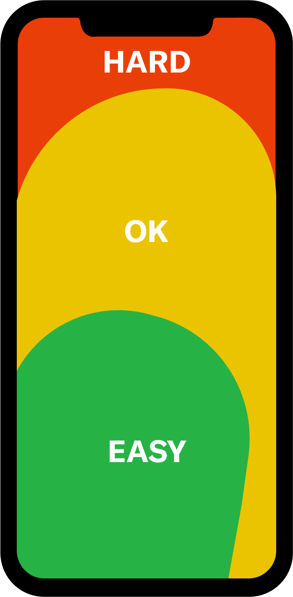

## 10 leyes principales de UX/UI ([uxenespanol.com][1], [lawsofux.com][2])

1. **Ley de Hick – “Menos es más”**

   * *Idea clave:* el tiempo para tomar una decisión crece con el número y la complejidad de las opciones.
   * *Ejemplo:* la [home de Google](https://www.google.com) muestra solo la caja de búsqueda, reduciendo la carga cognitiva. ([formiux.com][3])

   

   

   

2. **Ley de Fitts – “Haz el objetivo grande y cercano”**

   * *Idea clave:* el tiempo para alcanzar un objetivo depende de su tamaño y distancia.
   * *Ejemplo:* el botón Flotante de Acción (FAB) de [Material Design](https://m3.material.io/components/floating-action-button/overview) es grande y se ubica dentro del “pulgar dulce”. ([lawsofux.com][4])

   

   

   

3. **Ley de Jakob – “Los usuarios esperan consistencia”**

   * *Idea clave:* la gente transfiere expectativas de un producto conocido a otro parecido.
   * *Ejemplo:* el icono “hamburguesa” abre el menú lateral tanto en YouTube como en Gmail, cumpliendo la expectación.

4. **Ley de Miller – “Agrupa en bloques de 7 ± 2”**

   * *Idea clave:* la memoria de trabajo humana retiene entre 5 y 9 ítems; agrupar contenidos ayuda a retenerlos.
   * *Ejemplo:* los números de teléfono se dividen en bloques (p. ej. +34 911 23 45 67).

   

   

   

5. **Ley de Proximidad (Gestalt)**

   * *Idea clave:* los elementos cercanos se perciben como relacionados.
   * *Ejemplo:* la parrilla de productos de [Amazon](https://www.amazon.es) agrupa cada tarjeta con su foto, precio y CTA.

   

   

   

   

6. **Efecto Estética–Usabilidad**

   * *Idea clave:* la gente percibe los diseños más bellos como más fáciles de usar, incluso si no lo son.
   * *Ejemplo:* la pantalla de bloqueo de iOS combina animaciones fluidas y tipografía limpia, aumentando la confianza percibida.

   

   

   

   

   

   

7. **Ley de Parkinson – “El trabajo se expande…”**

   * *Idea clave:* una tarea se alarga hasta ocupar todo el tiempo disponible; los interfaces deben indicar tiempos límite claros (progress bars, timers).
   * *Ejemplo:* la barra de progreso de [Gmail](https://mail.google.com) durante subidas grandes mantiene la sensación de control.

   

   

   

8. **Efecto de Posición Serial (Primacía/Recencia)**

   * *Idea clave:* recordamos mejor el primer y el último ítem de una secuencia.
   * *Ejemplo:* la sección “Seguir viendo” aparece al inicio del home de [Netflix](https://www.netflix.com) para aprovechar la recencia.

   

   

   

9. **Ley de Tesler (Conservación de la Complejidad)**

   * *Idea clave:* todo sistema posee una complejidad irreductible; la cuestión es *quién* la asume (usuario o producto).
   * *Ejemplo:* el filtro avanzado de [Airbnb](https://www.airbnb.es) oculta opciones detrás de “+ Más filtros”, descargando al usuario casual.

   

   

   

   

10. **Efecto Von Restorff (Aislamiento)**

    * *Idea clave:* un elemento que contrasta con su entorno capta la atención y se recuerda mejor.
    * *Ejemplo:* el botón verde “Premium” en [Spotify](https://www.spotify.com) resalta sobre el resto de enlaces. ([keepcoding.io][5])

    

    

    

---

- [Leyes heurísticas](./leyex-ux-2.md)
