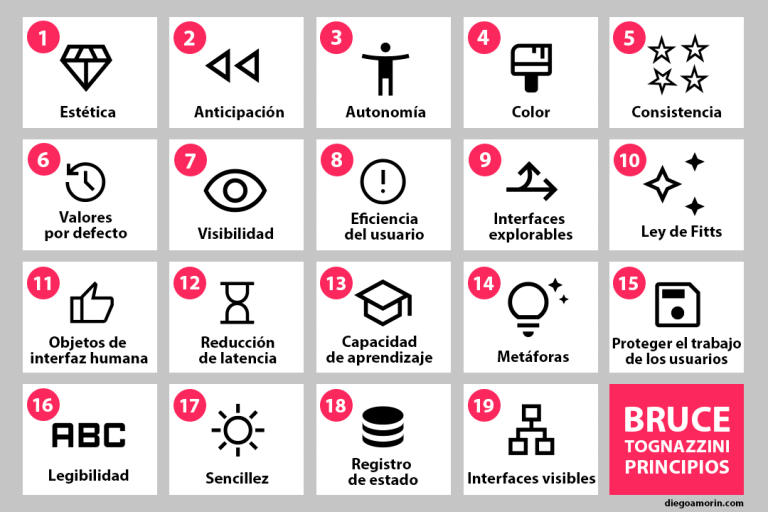

## 10 heurísticas de usabilidad de Nielsen Norman Group ([nngroup.com][6])

> **Referencia rápida:** Son reglas generales, no check-list rígido. Úsalas para auditar interfaces o guiar decisiones de diseño.

1. **Visibilidad del estado del sistema**

   * *Ejemplo:* el icono de “mensaje leído” doble-check azul en WhatsApp.

   

2. **Relación entre el sistema y el mundo real**

   * *Ejemplo:* el icono de papelera para “Eliminar” en la mayoría de OS móviles.

   

3. **Control y libertad del usuario**

   * *Ejemplo:* botón “Deshacer” que aparece tras archivar correos en Gmail.

   

4. **Consistencia y estándares**

   * *Ejemplo:* atajo **⌘+C / Ctrl+C** para copiar funciona igual en casi cualquier app de escritorio.

   

5. **Prevención de errores**

   * *Ejemplo:* el diálogo de confirmación al cerrar una pestaña con una descarga activa en Chrome.

   

6. **Reconocer mejor que recordar**

   * *Ejemplo:* historial de búsqueda desplegable en Google Maps.

   

7. **Flexibilidad y eficiencia de uso**

   * *Ejemplo:* power-users usan “/” para enfocar la barra de búsqueda en Twitter, novatos clican el icono.

   

8. **Diseño estético y minimalista**

   * *Ejemplo:* la vista de lectura de *Medium* es casi solo texto e imágenes, sin distracciones.

   

9. **Ayudar a reconocer, diagnosticar y recuperarse de errores**

   * *Ejemplo:* mensaje “Contraseña incorrecta” indica causa y sugiere restablecer en la página de login de Dropbox.

   

10. **Ayuda y documentación**

    * *Ejemplo:* los tooltips contextuales que aparecen en Figma al pasar el cursor sobre un ícono nuevo.

    

---

## Referencias

1. [10 leyes principales de UX/UI - UX en Español](https://uxenespanol.com/articulo/10-leyes-principales-de-uxui)
2. [Ley De Tesler - Laws of UX](https://lawsofux.com/es/ley-de-tesler/)
3. [Ley de Hick en UX - ¿Cómo funciona y cuando se aplica? - Formiux](https://formiux.com/ley-de-hick/)
4. [Ley De Fitts - Laws of UX](https://lawsofux.com/es/ley-de-fitts/) 
5. [¿Qué es el efecto Von Restorff aplicado a UX? - KeepCoding](https://keepcoding.io/blog/que-es-el-efecto-von-restorff-aplicado-a-ux/) 
6. [10 Usability Heuristics for User Interface Design - NN/g](https://www.nngroup.com/articles/ten-usability-heuristics/) 
