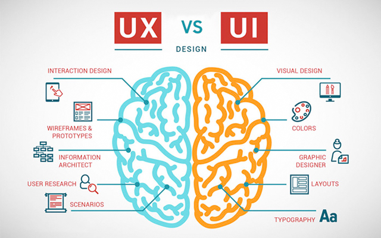
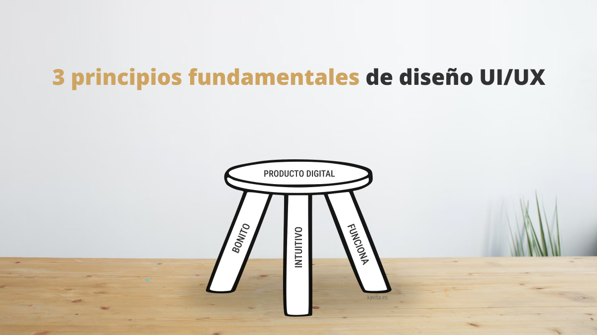
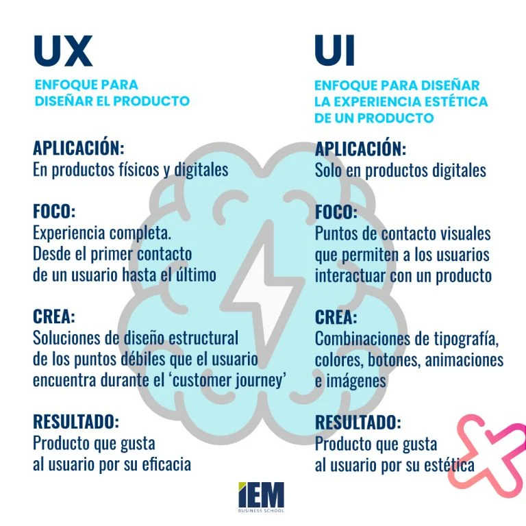
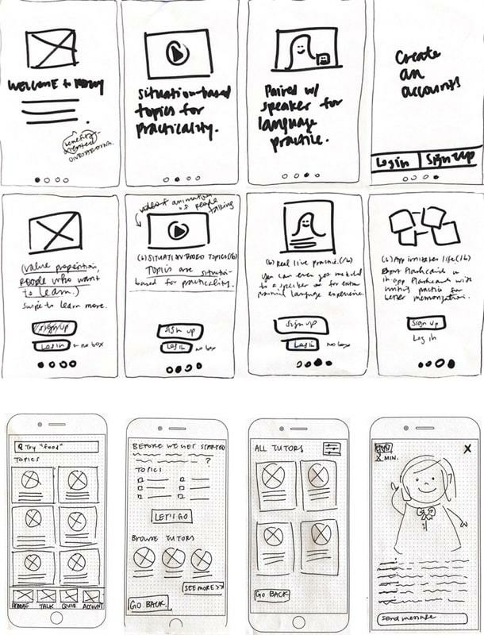
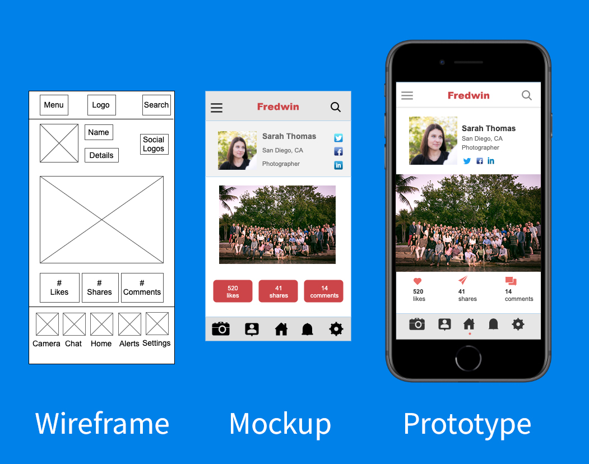

## 🧠 **Introducción al Diseño UX y Diseño de Interfaces UI**

### 1. ¿Qué es UX y qué es UI?

* **UX (User Experience)** — *Experiencia de usuario*:

  * Se refiere a cómo se siente una persona al interactuar con un producto digital.
  * Objetivo: que el usuario complete sus tareas de forma **rápida, fácil e intuitiva**.
  * Incluye: usabilidad, accesibilidad, arquitectura de la información, flujos de usuario.

* **UI (User Interface)** — *Interfaz de usuario*:

  * Es la parte **visual** con la que el usuario interactúa.
  * Incluye: colores, tipografía, botones, iconos, espaciado, jerarquía visual.
  * Es el “look & feel” del producto.

  

---

### 2. Diferencias clave entre UX y UI

| UX (Experiencia)                        | UI (Interfaz Visual)              |
| --------------------------------------- | --------------------------------- |
| Diseño centrado en el usuario           | Diseño visual de la interfaz      |
| Analiza problemas, necesidades y flujos | Aplica estilos, colores y layouts |
| Se basa en investigación y testeo       | Se basa en principios gráficos    |

---

### 3. Principios básicos del diseño UX

* **Claridad**: que todo se entienda rápido.
* **Consistencia**: que las cosas funcionen igual en toda la app/web.
* **Accesibilidad**: que cualquier persona pueda usarlo, incluso con limitaciones físicas.
* **Feedback**: que la interfaz responda a las acciones del usuario.
* **Jerarquía visual**: mostrar qué es más importante en cada pantalla.

---

### 4. Buenas prácticas de UI

* Contraste suficiente entre fondo y texto.
* Uso coherente de colores y tipografías.
* Botones grandes y bien diferenciados.
* Espaciado adecuado para evitar confusión visual.
* Íconos comprensibles y acompañados de texto cuando sea necesario.

---

### 5. Herramientas comunes

* **Wireframes**: bocetos simples de las pantallas.
* **Mockups**: diseño más detallado y visual.
* **Prototipos**: versión interactiva que simula la app real.
* Herramientas: *Figma*, *Adobe XD*, *Canva*, *Balsamiq*, papel y lápiz.

---

- [Introducción al UX](./intro-ux.md)
- [Introducción al UX - Parte 2](./intro-ux-2.md)
- [Introducción al UI](./intro-ui.md)
- [Glosario](./glosario.md)